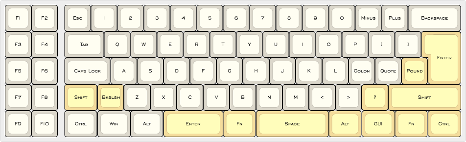
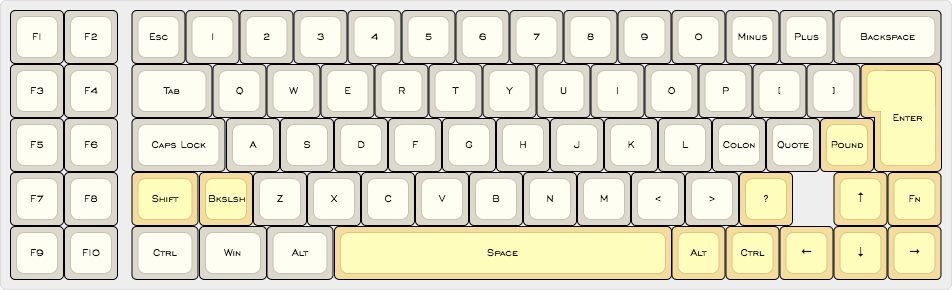
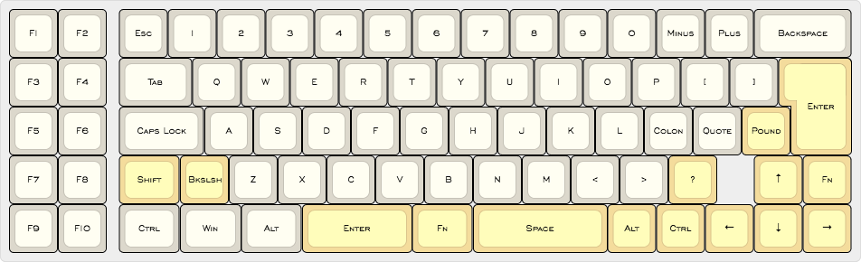

# Kona Classic Firmware

The Kona Classic is a 60% layout + left Function keys. Using a Teensy as the controller, the Kona Classic is provided as a do-it-yourself kit for left f-key enthusiasts.

Keyboard Maintainer: [Maximillian Hill](https://github.com/DangerousParts)  
Hardware Supported: Teensy 2.0  
Hardware Availability: Via GB

You can download precompiled HEX files for the following layouts:

Default:
  

ANSI:
  

ANSI_split:
  

ANSI_arrows:
  

ANSI_split_arrows:
  

ISO:
  

ISO_split:
  

ISO_arrows:
  

ISO_split_arrows:
  

You can also find the source for these layouts in our QMK fork, [here](https://github.com/DangerousParts/qmk_firmware).