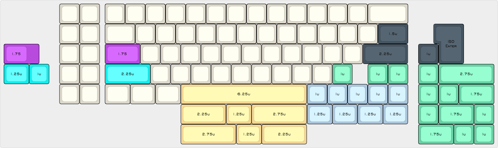

# KonaClassic

## What is the Kona Classic?

The Kona Classic is provided as a keyboard kit for left-side F Key enthusiasts who want a no-frills, fully programmable keyboard that won't break the bank. The Kona Classic features a left-side F Keys next to a 60% layout with a slew of layout options (arrow keys, split space, ISO enter/shift, stepped caps, and more!). The keyboard is controlled by a Teensy 2.0 and pays homage to early computing by employing through-hole diodes on a green PCB. For cases, I have developed a an acrylic sandwich case and am looking for a vendor for a milled plastic or wooden case.

## Assembly Overview
(this assumes you're using the kit sold in the Kona Classic group buy)

1. Remove the protective paper on each piece of the sandwich case
2. Install and solder diodes into the PCB - the cathode (the end with the line) goes into the square holes
3. Install PCB mount stabilizers - depending on your layout, you will need 3-6 2u and up to 1 6.25u stabilizers
4. Insert and solder the Teensy header pins with the shorter end through the PCB (but DO NOT solder the Teensy on yet!)
5. Insert switches though the delrin switch plate and solder them into the PCB (delrin is very flexible, unlike acrylic, so you shouldn't have any issues with it breaking) - The switch for the ANSI backslash is upside-down by design
6. Solder the Teensy onto the previously installed header pins (make sure the reset button is facing out)
7. It is recommended that you clip the header pins so that they don't protrude past the Teensy
8. Optionally install RGB underglow strip by soldering the wires to the exposed pads near the PCB edge furthest from the Teensy - the strip can be cut to length and has an adhesive backing
9. Re-assemble your case
10. Flash the Teensy with the layout of your choosing and enjoy!

I have also created a step-by-step [build log](https://imgur.com/a/D8GG9) if you'd like a visual guide.

## Flashing the firmware

Because the Kona Classic uses a Teensy as the controller, the firmware it uses is [QMK](https://github.com/qmk/qmk_firmware). You can download [pre-compiled firmware](KonaClassic/QMKFirmware/) for your Kona Classic or compile it yourself [from source](KonaClassic/QMKFirmware/source/).

## Other resources

If you have questions or concerns, my username is /u/AuthenticDanger on Reddit.